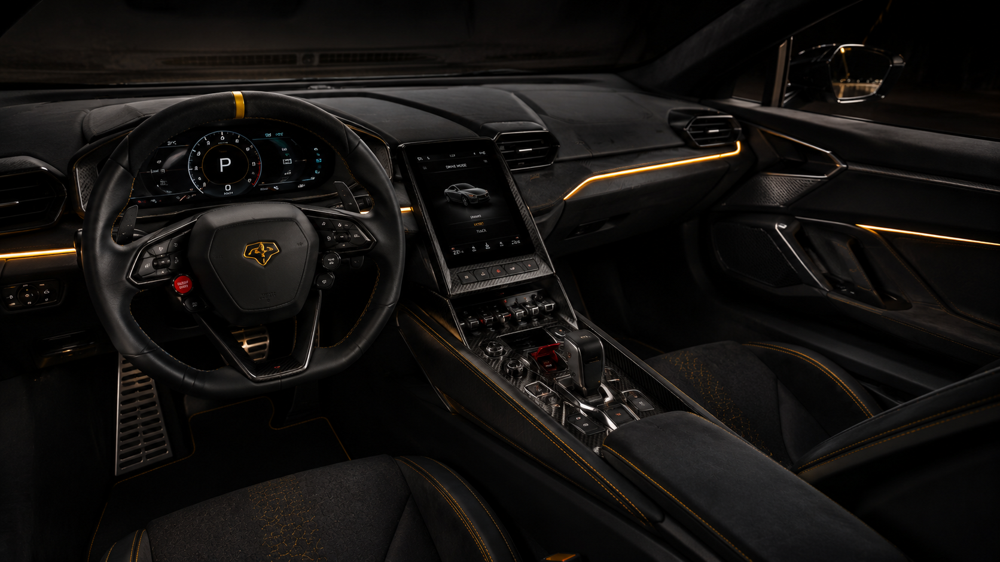
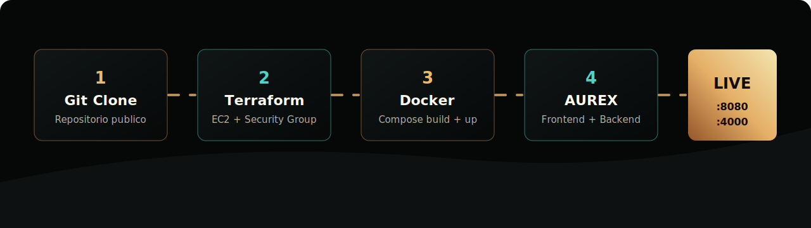
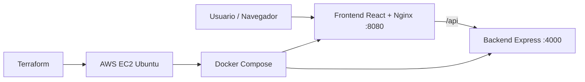

<div align="center">


# 🏎️ AUREX HyperCars

### Servicio telemático full stack con despliegue automático en AWS


**AUREX** es una marca ficticia de hypercars deportivos de lujo, creada como proyecto académico para demostrar una aplicación web consumible, contenerizada y desplegable automáticamente en AWS.

[🚀 Despliegue AWS](#-despliegue-automatico-en-aws) ·
[🐳 Docker Local](#-ejecutar-con-docker-compose) ·
[🧩 Backend API](#-endpoints-del-backend) ·
[📸 Evidencias](#-evidencias-sugeridas)

</div>

---

## ✨ Vista General

| Área | Descripción |
|---|---|
| 🖥️ Frontend | React + Vite + Nginx, diseño premium responsive, configurador visual, galería y mapa de concesionarios. |
| ⚙️ Backend | API REST con Express: marca, modelos, precios, créditos, acreditaciones y concesionarios. |
| 🐳 Contenedores | `docker-compose.yml` construye y ejecuta frontend + backend. |
| ☁️ AWS | Terraform crea EC2, abre puertos, instala Docker, copia el proyecto y levanta la app. |
| 🧾 Entrega | El profesor solo debe clonar, configurar AWS y ejecutar un script. |

---

## 🎨 Preview Visual

<div align="center">
  
</div>

<table>
  <tr>
    <td align="center"><br><b>Noctis V12</b></td>
    <td align="center"><br><b>Tempest E-Hybrid</b></td>
    <td align="center"><br><b>Rayo GT4</b></td>
  </tr>
</table>

<table>
  <tr>
    <td align="center"><br><b>Cockpit premium</b></td>
    <td align="center"><br><b>AUREX House</b></td>
  </tr>
</table>

---

## 🧠 Arquitectura





```text
Navegador
   |
   | http://IP_PUBLICA:8080
   v
Frontend React + Vite + Nginx
   |
   | /api/*
   v
Backend Express REST API
```

---

## 📁 Estructura Del Proyecto

```text
AUREX-HyperCars/
├── backend/
│   ├── src/
│   │   ├── data.js
│   │   └── server.js
│   └── Dockerfile
├── frontend/
│   ├── public/assets/
│   ├── src/
│   │   ├── main.jsx
│   │   └── styles.css
│   ├── nginx.conf
│   └── Dockerfile
├── infra/terraform/
│   ├── main.tf
│   ├── variables.tf
│   ├── outputs.tf
│   └── cloud-init.sh.tpl
├── scripts/
│   ├── terraform-deploy.sh
│   ├── terraform-destroy.sh
│   └── deploy-aws.sh
├── docker-compose.yml
└── README.md
```

---

## 🚀 Despliegue Automático En AWS

> ✅ Este es el flujo principal de entrega.  
> Terraform crea la infraestructura y deja la aplicación funcionando automáticamente.

### 1. Requisitos

El PC que ejecuta el proyecto necesita:

```bash
aws --version
terraform -version
ssh -V
git --version
```

En AWS Academy se deben copiar las credenciales desde **AWS Details** y configurar:

```bash
mkdir -p ~/.aws
nano ~/.aws/credentials
```

```ini
[default]
aws_access_key_id=TU_ACCESS_KEY
aws_secret_access_key=TU_SECRET_KEY
aws_session_token=TU_SESSION_TOKEN
```

```bash
nano ~/.aws/config
```

```ini
[default]
region=us-east-1
output=json
```

Validar credenciales:

```bash
aws sts get-caller-identity
```

### 2. Ejecutar

```bash
git clone URL_DEL_REPOSITORIO
cd AUREX-HyperCars
chmod +x scripts/terraform-deploy.sh
./scripts/terraform-deploy.sh
```

Si AWS Academy no permite `t3.small`, usar:

```bash
./scripts/terraform-deploy.sh us-east-1 t2.micro
```

### 3. Resultado Esperado

Terraform imprimirá salidas similares a:

```text
frontend_url = "http://IP_PUBLICA:8080"
backend_health_url = "http://IP_PUBLICA:4000/api/health"
ssh_command = "ssh -i ~/.ssh/aurex-telematica ubuntu@IP_PUBLICA"
```

Abrir:

```text
http://IP_PUBLICA:8080
```

Y validar API:

```text
http://IP_PUBLICA:4000/api/health
```

### 4. Recursos Creados

| Recurso | Detalle |
|---|---|
| EC2 | Ubuntu en `us-east-1` |
| Security Group | Puertos `22`, `80`, `8080`, `4000` |
| Key Pair | Llave pública local registrada en AWS |
| Docker | Instalado automáticamente con `cloud-init` |
| App | Copiada a `/opt/aurex` |
| Compose | Ejecuta `docker compose up -d --build` |

---

## 🐳 Ejecutar Con Docker Compose

Ideal para probar localmente antes de AWS:

```bash
docker compose up -d --build
docker compose ps
```

Abrir:

```text
Frontend: http://localhost:8080
Backend:  http://localhost:4000/api/health
```

Detener:

```bash
docker compose down
```

---

## 🛠️ Desarrollo Local

### Backend

```bash
cd backend
npm install
npm run dev
```

Backend:

```text
http://localhost:4000/api/health
```

### Frontend

```bash
cd frontend
npm install
npm run dev
```

Frontend:

```text
http://localhost:5173
```

Si Vite usa otro puerto, abrir el que muestre la terminal.

---

## 🧩 Endpoints Del Backend

| Método | Ruta | Descripción |
|---|---|---|
| `GET` | `/api/health` | Estado del servicio |
| `GET` | `/api/brand` | Identidad de marca |
| `GET` | `/api/models` | Catálogo de autos, precios y especificaciones |
| `GET` | `/api/models/:id` | Detalle de un modelo |
| `GET` | `/api/financing` | Opciones de crédito |
| `GET` | `/api/accreditations` | Acreditaciones y garantías |
| `GET` | `/api/dealers` | Concesionarios en Colombia |

Ejemplo:

```bash
curl http://localhost:4000/api/models
```

Respuesta resumida:

```json
[
  {
    "id": "noctis-v12",
    "name": "Noctis V12",
    "priceFormatted": "$1.950.000.000",
    "powerHp": 820,
    "topSpeed": "342 km/h"
  }
]
```

---

## 🔒 Puertos Y Seguridad

| Puerto | Uso | Acceso |
|---:|---|---|
| `22` | SSH | Solo IP pública del usuario que despliega |
| `80` | HTTP opcional | Público |
| `8080` | Frontend | Público |
| `4000` | Backend API / healthcheck | Público |

> En una entrega productiva real se recomienda cerrar `4000` al público y exponer la API solo detrás de Nginx. Para este proyecto académico se deja visible para evidencia de backend.

---

## 🧪 Verificación Rápida

```bash
cd frontend
npm run build
```

```bash
cd ../backend
npm audit --audit-level=moderate
```

```bash
cd ..
docker compose up -d --build
docker compose ps
```

En AWS:

```bash
terraform output
```

---

## 🧯 Apagar Infraestructura

Para evitar consumo de créditos en AWS Academy:

```bash
chmod +x scripts/terraform-destroy.sh
./scripts/terraform-destroy.sh
```

Resultado esperado:

```text
Destroy complete!
```

---

## 📸 Evidencias Sugeridas

- ✅ Captura del frontend en `http://IP_PUBLICA:8080`.
- ✅ Captura del backend en `http://IP_PUBLICA:4000/api/health`.
- ✅ Captura de `terraform apply` con `Apply complete`.
- ✅ Captura de `docker compose ps` con frontend y backend `Up`.
- ✅ Enlace del repositorio público.

---

## 🏁 Identidad De Marca

| Elemento | Valor |
|---|---|
| Marca | **AUREX HyperCars** |
| Segmento | Hypercars deportivos de lujo |
| Competencia ficticia | Ferrari, Lamborghini, Porsche |
| Propuesta | Ingeniería premium, experiencia boutique, financiación y red nacional |
| País | Colombia |

---

## 📚 Fuentes Oficiales

- [AWS CLI](https://docs.aws.amazon.com/cli/latest/userguide/getting-started-install.html)
- [AWS Configure](https://docs.aws.amazon.com/cli/latest/reference/configure/)
- [EC2 Key Pairs](https://docs.aws.amazon.com/AWSEC2/latest/UserGuide/ec2-key-pairs.html)
- [Terraform Install](https://developer.hashicorp.com/terraform/intro/getting-started/install.html)
- [Docker Compose Plugin](https://docs.docker.com/compose/install/linux/)

---

<div align="center">

### ⚡ AUREX HyperCars

**Frontend + Backend + Docker + Terraform + AWS Academy**

Proyecto académico de telemática listo para clonar, desplegar y verificar.

</div>
